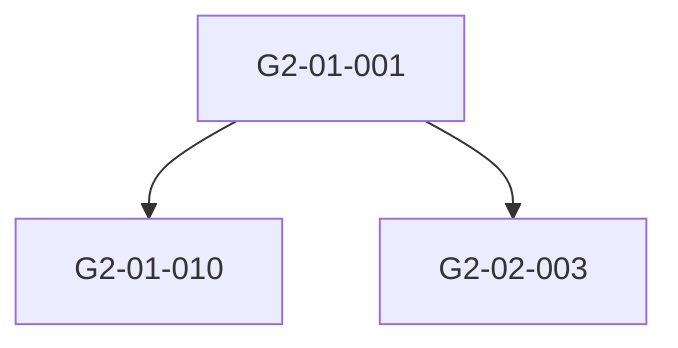

```yaml
제목: <% tp.file.title %>
카테고리: <% tp.file.folder(true).split("/").pop() %>
작성자: 현카엘
최초작성일: <% tp.date.now("YYYY-MM-DD HH:mm") %>
최종수정일: <% tp.date.now("YYYY-MM-DD HH:mm") %>
문서버전: "0.1"
최근 변경 요약:
복원여부: false
사용된 템플릿: 10-기술·연구 테크트리 설정 템플릿
템플릿 버전: 0.1.0
태그:
  - <% tp.file.folder(true).split("/").pop() %>
  - <% tp.file.title %>
```
> [!caution] 미작성, 미검토 내용·문서
> <center>이 문구 이후는 아직 작성되지 않았거나, 검토되지 않은 내용입니다.</center>

# 개요
-  이 문서는 <font style="font-weight:bold">제2기(이후) 기술/연구 테크트리</font>를 ‘시대별 게이트 + 선후관계(엣지)’로 관리하기 위한 <font style="font-weight:bold">전역 템플릿</font>이다.
-  목표: (1) 시대별 기술(게이트) 목록의 일관성 확보 (2) 선후관계 기반 트리/그래프 생성 (3) 하위문서화 기준 통일.
-  참조 문서(필수):
  -  [[제_2_기_연구트리_분류체계_3_단계_하위_세부_보완_패치_반영본]]
  -  (선택) [[제_1_기_시대별_기준기술_게이트_연구트리_3_단계_매핑표_실전판]]

<hr class="hr-thick-2">

## 작성/수정일


### 과거 문서 계승 및 복원 여부

<div class="scroll-x nowrap"><table>
  <thead>
    <tr>
      <th colspan="4">과거 문서 계승 및 복원 여부</th>
    </tr>
  </thead>
  <tbody>
    <tr>
      <td colspan="2">여부</td>
      <td colspan="2">원문 관련</td>
    </tr>
    <tr>
      <td>⭕</td>
      <td>❌</td>
      <td>최초 작성일</td>
      <td rowspan="3">❌</td>
    </tr>
    <tr>
      <td><input id="hc-6863" type="checkbox"></td>
      <td><input id="hc-1418" type="checkbox" checked></td>
      <td>최종 수정일</td>
    </tr>
    <tr>
      <td colspan="3">복원 문서명</td>
    </tr>
  </tbody>
</table></div>


### 상세 수정 내역
-  [[템플릿 수정 기록#10-기술·연구 테크트리 설정 템플릿]]
-  [[문서수정기록 파일링크]]

<hr class="hr-thick-1">

# 기본 설정

## 10-1. 적용 범위
-  적용 기수: <font style="font-weight:bold">제2기 이후</font>
-  운영 방식(권장):
  -  <font style="font-weight:bold">시대 문서(인덱스)</font>: 시대별 게이트 목록/요약 표
  -  <font style="font-weight:bold">게이트 문서(노드)</font>: 각 기술/제도/연구 게이트의 단일 진실(Single Source of Truth)
  -  <font style="font-weight:bold">엣지 레지스트리(관계)</font>: `A → B` 선후관계만 모은 전역 표(트리 생성/검증용)

## 10-2. 폴더/문서 구조(권장)

<div class="scroll-x nowrap"><table>
  <thead>
    <tr>
      <th>구분</th>
      <th>권장 경로</th>
      <th>문서 역할</th>
    </tr>
  </thead>
  <tbody>
    <tr>
      <td>전역 규칙</td>
      <td>`10-기술·연구/00-규칙/`</td>
      <td>표기 규칙, 코드 정의, 분류체계 링크</td>
    </tr>
    <tr>
      <td>시대 인덱스</td>
      <td>`10-기술·연구/01-시대/`</td>
      <td>시대별 게이트 표(요약/목차)</td>
    </tr>
    <tr>
      <td>게이트(노드)</td>
      <td>`10-기술·연구/02-게이트/`</td>
      <td>게이트 상세 본문(선행/후속/근거 포함)</td>
    </tr>
    <tr>
      <td>선후관계(엣지)</td>
      <td>`10-기술·연구/03-엣지/`</td>
      <td>관계 표(그래프 생성, 사이클 점검)</td>
    </tr>
  </tbody>
</table></div>


> [!tip] 운영 원칙
> 시대 문서는 <font style="font-weight:bold">얇게(표 중심)</font>, 게이트 문서는 <font style="font-weight:bold">두껍게(설명/근거/관계 중심)</font>, 엣지는 <font style="font-weight:bold">관계만</font>.

<hr class="hr-thick-2">

## 10-3. 표기 규칙(고정 키)

### 식별자 규칙

<div class="scroll-x nowrap"><table>
  <thead>
    <tr>
      <th>항목</th>
      <th>규칙</th>
      <th>예시</th>
    </tr>
  </thead>
  <tbody>
    <tr>
      <td>기수 코드</td>
      <td>`P2` / `2` 중 하나로 통일</td>
      <td>`P2`</td>
    </tr>
    <tr>
      <td>시대 코드</td>
      <td>`2-01, 2-02...` (2기-시대번호)</td>
      <td>`2-03`</td>
    </tr>
    <tr>
      <td>게이트 ID</td>
      <td>`G2-<시대>-<연번3>`</td>
      <td>`G2-03-001`</td>
    </tr>
    <tr>
      <td>표 No</td>
      <td>표 보기용(변경 가능)</td>
      <td>`1,2,3...`</td>
    </tr>
  </tbody>
</table></div>


### 성숙도/단계 표기(TMC)
-  기존 합의안 사용: `<ERA>-<TRL>` (예: `MOD-7～9`)
-  (선택) 특수 오버레이는 `+`로 덧붙임: 예) `MOD-7～9+ARC`

<div class="scroll-x nowrap"><table>
  <thead>
    <tr>
      <th>오버레이</th>
      <th>의미(예시)</th>
      <th>사용 기준</th>
    </tr>
  </thead>
  <tbody>
    <tr>
      <td>`+ARC`</td>
      <td>차원/대전이/초상현상 계열 게이트</td>
      <td>연구트리 `3-8` 계열에 강하게 연동될 때</td>
    </tr>
    <tr>
      <td>`+WAR`</td>
      <td>전쟁 특수(총력전/군사혁신)</td>
      <td>`3-4` 계열이 핵심축일 때</td>
    </tr>
    <tr>
      <td>`+CIV`</td>
      <td>행정/제도 혁신이 핵심(국가역량)</td>
      <td>`3-3` 계열이 핵심축일 때</td>
    </tr>
  </tbody>
</table></div>


> 오버레이는 “표기 선택 사항”이다. 쓰려면 <font style="font-weight:bold">전역 규칙(이 문서)</font>에 정의하고, 안 쓰면 과감히 빼자.

<hr class="hr-thick-1">

# 세부 설정

## 10-4. 시대 인덱스 문서 템플릿(복붙용)
```md
---
doc_type: era_gate_index
era: "2-01"
era_name: "(시대명)"
period: "2"
version: v1
---

## 제2기 01. (시대명)

<div class="scroll-x nowrap"><table>
  <thead>
    <tr>
      <th>No</th>
      <th>gate_id</th>
      <th>게이트(인링크)</th>
      <th>상징명(게임/현실)</th>
      <th>연구트리 3단계 매핑</th>
      <th>게이트 효과/의미(한줄)</th>
      <th>TMC</th>
      <th>Ref 키워드</th>
    </tr>
  </thead>
  <tbody>
    <tr>
      <td>1</td>
      <td>G2-01-001</td>
      <td><a href="/kael/G2-01-001+-+(게이트명)">G2-01-001 - (게이트명)</a></td>
      <td></td>
      <td></td>
      <td></td>
      <td></td>
      <td></td>
    </tr>
  </tbody>
</table></div>


### 추가 후보(선택)
<div class="scroll-x nowrap"><table>
  <thead>
    <tr>
      <th>No</th>
      <th>gate_id</th>
      <th>게이트(인링크)</th>
      <th>비고</th>
    </tr>
  </thead>
  <tbody>
    <tr>
      <td>9</td>
      <td>G2-01-009</td>
      <td><a href="/kael/G2-01-009+-+(게이트명)">G2-01-009 - (게이트명)</a></td>
      <td></td>
    </tr>
  </tbody>
</table></div>

```

## 10-5. 게이트(노드) 문서 템플릿(복붙용)
```md
---
doc_type: gate_node
gate_id: G2-01-001
gate_name: "(게이트명)"
period: "2"
era: "2-01"
tmc: "MOD-7～9"
# 연구트리 3단계 매핑(복수 가능)
tree_map:
  - "3-2A → (분야명)"
  - "3-13B → (분야명)"
# 선행조건/후속(여기에는 ID만. 설명은 본문에서)
prereq:
  hard: []
  soft: []
unlocks: []
# 키워드(검색/태깅용)
tags: [gate, tech, period2, era_2_01]
# 연결(선택)
linked_events: []
linked_institutions: []
---

# 개요
-  (2～5문장)

<hr class="hr-thick-1">

# 왜 이게 ‘게이트’인가
-  시대 내 변곡점(사회/군사/경제/행정 중 최소 1개 축)과 연결해 서술.

<hr class="hr-thick-1">

# 연구트리 매핑 근거(3단계)
-  매핑한 이유를 간단히.

<hr class="hr-thick-1">

# 선행조건(Prereq)
## Hard
-  
## Soft
-  

<hr class="hr-thick-1">

# 후속/파생(Unlocks)
-  

<hr class="hr-thick-1">

# 대체 경로/상호배타(선택)
-  

<hr class="hr-thick-1">

# 세계관 연계(선택)
## 사건
-  
## 기관/제도
-  

<hr class="hr-thick-1">

# 참고 및 인용
> 필요시.
```

## 10-6. 엣지 레지스트리(관계) 템플릿(복붙용)
```md
---
doc_type: gate_edges
scope: "제2기 전체"
version: v1
---

<div class="scroll-x nowrap"><table>
  <thead>
    <tr>
      <th>from_gate</th>
      <th>to_gate</th>
      <th>rel_type</th>
      <th>weight</th>
      <th>note</th>
    </tr>
  </thead>
  <tbody>
    <tr>
      <td>G2-01-001</td>
      <td>G2-01-010</td>
      <td>prereq_hard</td>
      <td>1.0</td>
      <td>핵심 선행</td>
    </tr>
    <tr>
      <td>G2-01-001</td>
      <td>G2-02-003</td>
      <td>prereq_soft</td>
      <td>0.6</td>
      <td>대체경로 가능</td>
    </tr>
  </tbody>
</table></div>


## rel_type 사전
- prereq_hard: 필수 선행
- prereq_soft: 권장/우회 가능
- alt_path: 대체 루트(동등)
- synergy: 시너지(동시 보유 시 효과 증가)
- obsoletes: 시대가 지나며 사실상 대체/구식화
- mutex: 상호배타(같은 슬롯/같은 교리)
```

## 10-7. (선택) 트리 시각화 스니펫(mermaid)
```md


<hr class="hr-thick-1">

# 운영 체크리스트

## 새 게이트 추가 시
- [ ] `gate_id`가 <font style="font-weight:bold">유일</font>한가(중복 없음)
- [ ] 시대 인덱스 표에 `gate_id + 인링크`가 들어갔는가
- [ ] 게이트 문서(frontmatter)의 `tree_map`이 <font style="font-weight:bold">3단계 분류체계</font>에 실제로 존재하는가
- [ ] `prereq/unlocks`가 있으면 엣지 레지스트리에도 동일하게 반영했는가
- [ ] “왜 게이트인가”가 <font style="font-weight:bold">시대 변곡점</font>과 연결되어 있는가(서사/정치/경제 중 최소 1)

## 선후관계(엣지) 점검
- [ ] 의도치 않은 <font style="font-weight:bold">사이클</font>이 생기지 않는가(필요하면 `alt_path`로 분리)
- [ ] 지나치게 허브 1개에 몰리지 않는가(병목이 의도인지 확인)
- [ ] 시대를 넘어가는 엣지(예: `2-01 → 2-04`)는 <font style="font-weight:bold">설명(note)</font>를 붙였는가

<hr class="hr-thick-1">

# 기타 설정
## 기타 서술
-  정형화되지 않은 기타 설정에 대해서 서술. 없다면 삭제.

<hr class="hr-thick-2">

## 관련 링크
-  [[제_2_기_연구트리_분류체계_3_단계_하위_세부_보완_패치_반영본]]
-  [[(제2기 시대 구분 문서)]]
-  [[(제2기 기술 게이트 인덱스)]]

<hr class="hr-thick-2">

## 참고
> 추가 설명, 원문 인용 등 필요하면 여기에.

<hr class="hr-thick-1">

# 각주 및 외부 링크

